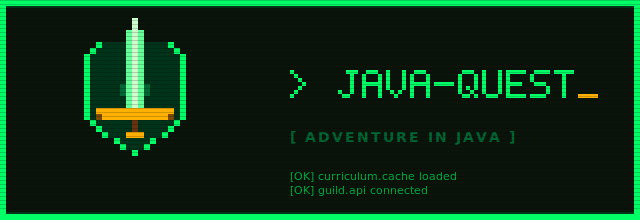

<p align="center">
  
</p>

# java-quest

> ⚠️ **アルファ版（v0.1.x）です** — 本スキルは現在アルファ版です。仕様・API・データスキーマの破壊的変更、サーバー（API）の一時停止・終了、保存データの初期化が**予告なく**発生する可能性があります。気軽にお試しいただく分には歓迎ですが、重要な学習成果はローカル（`{source_root}/java-quest/` 配下）に残るため、必要に応じて別途バックアップを推奨します。詳細は [バージョニング / 更新方針](#バージョニング--更新方針) 参照。

**AIチューター「リーナ」と巡る、RPG風Java学習スキル。**
エリア（章）とダンジョン（単元）を踏破しながら、講義 → 演習 → ボス戦の流れで Java の基本構文を体に染み込ませていきます。レベル・職業・称号まで揃った RPG 的進行で、学習継続を仕組み化するのがこのスキルの狙いです。

クリアごとに経験値と称号が積み上がり、基本職（剣士・武闘家）を極めれば上級職「狂戦士」が解放されます。進捗は専用 API に保存されるため、環境を移しても UUID さえあれば冒険を再開できます。

---

## 対象ユーザー / 前提知識

- **対象**: これから Java を本格的に始めたい人、独学で挫折した経験のある人、ゲーム的な動機付けで継続学習したい人。
- **前提知識**: プログラミングの経験は不要。ただし以下の操作が最低限できること。
  - ターミナル（シェル）でのコマンド実行
  - テキストエディタでのファイル編集
- **環境要件**:
  - Java 実行環境（`java`, `javac` が PATH に通っていること。未インストール時は起動フローで案内されます）
  - `curl` が使えるネットワーク接続（進捗 API と通信するため）
  - Claude Code 本体（このスキルは Claude Code から発動する前提）

---

## カリキュラム構成

カリキュラムは `curriculum.yaml` に定義され、スキル起動時に配信 API から取得されます。MVP v1.0.0 時点の構成は以下の通り。

### エリアとダンジョン

| エリア | ダンジョン | 主題 |
|---|---|---|
| **はじまりの平原**（入門） | C1-01 プログラムの構造 | class / main / コンパイル・実行 |
|  | C1-02 標準出力 | `println` / `print` / `printf` |
|  | C1-03 変数と型（数値） | int / long / double / float |
|  | C1-04 変数と型（文字列・真偽値） | String / char / boolean |
|  | C1-05 算術演算・キャスト | 四則演算・整数除算・型変換 |
|  | C1-06 標準入力（Scanner） | 入力→処理→出力の対話 |
| **分岐の森**（制御構文） | C1-07 if / else | 条件分岐の基本 |
|  | C1-08 比較・論理演算子 | 複合条件と短絡評価 |
|  | C1-09 switch 文・式 | 多分岐と fall-through |
|  | C1-10 for 文 | カウンタ制御と累積 |
|  | C1-11 while / do-while | 条件ベースの反復 |
|  | C1-12 ネスト・break・continue | フロー制御の仕上げ |

各ダンジョンには `learning_goals`（習得ゴール）、`lecture_topics`（講義項目）、`exercise_hints`（演習テーマ）、`boss_description`（ボス問題の軸）が定義されており、AI チューターはこれらを元に毎回異なる問題を生成します。

### 職業システム

- **基本職**
  - **剣士**（言語コア / 入門）— C1-01〜C1-06 の全スキル習得でマスター
  - **武闘家**（言語コア / 制御構文）— C1-07〜C1-12 の全スキル習得でマスター
- **上級職**
  - **狂戦士** — 剣士と武闘家の両方をマスターすると解放

### レベル・称号（MVP 上限: Lv.5）

| Lv | 称号 | 次レベルまで |
|---|---|---|
| 1 | かけだし冒険者 | 100 EXP |
| 2 | 見習いプログラマ | 150 EXP |
| 3 | 一人前の書き手 | 200 EXP |
| 4 | 条件の見極め人 | 250 EXP |
| 5 | ループの旅人 | （MVP 上限） |

---

## インストール

Claude Code のプラグインマーケットプレイス経由で導入します。

```
/plugin marketplace add kirin1218/java-quest
/plugin install java-quest@java-quest
```

1 行目で GitHub リポジトリをマーケットプレイスとして登録し、2 行目で `java-quest` プラグインを実際にインストールします（`@java-quest` 部分は「マーケットプレイス名」です）。

インストールが完了すると、Claude Code のセッションで `/java-quest` が呼び出せるようになります。初回起動時はそのまま `/java-quest` を実行して、冒険者登録に進んでください。

### インストール確認

```
/plugin list
```

`java-quest` が一覧に表示されていれば導入成功です。

---

## アップデート

マーケットプレイスの最新情報を取得したうえで、プラグインを更新します。

```
/plugin marketplace update java-quest
/plugin update java-quest
```

カリキュラム（`curriculum.yaml`）とボス採点ロジックは配信 API 側で更新されるため、**カリキュラムの追加・修正にはプラグイン更新不要**です。プラグイン更新が必要になるのは、SKILL.md 本体やセリフ・提示テンプレート等を改訂したタイミングに限られます。

更新後は `/plugin list` で version 表記が上がっているかを確認してください。

---

## アンインストール

プラグインの削除:

```
/plugin uninstall java-quest
```

マーケットプレイス登録自体も消したい場合:

```
/plugin marketplace remove java-quest
```

### 冒険データの扱い

プラグインを削除しても、ローカルの冒険データ（冒険者設定・講義メモ・演習成果物など）は残ります。再インストール時に UUID を入力すれば冒険を再開できます。

完全にリセットしたい場合は、以下のフォルダを削除してください。

- `~/.config/java-quest/` — 冒険者設定一式
- `{source_root}/java-quest/` — 講義メモ・演習成果物・UUID バックアップ

サーバー側の進捗データ（UUID 紐付け）の削除を希望する場合は、本リポジトリの Issue からリクエストしてください。

---

## 使い方

### Claude Code からの発動

Claude Code のセッションで次のように呼び出します。

```
/java-quest
```

スキルが起動すると、AI チューター **リーナ** が進行役として対話を担当します。

### 初回起動（新規冒険者）

> **データ取得に関するお知らせ**: 本スキルは学習進捗管理のため、冒険者名・冒険者番号（UUID）・学習進捗を配信 API のサーバーに保存します。詳細は [PRIVACY.md](./PRIVACY.md) を参照してください。初回起動時に内容を提示し、同意を確認します。

1. リーナが冒険者ギルドへの歓迎を行います。
2. プライバシーポリシー（[PRIVACY.md](./PRIVACY.md)）の要点を提示し、同意を確認します。
3. **冒険者名** と **開発ソースのルートフォルダ**（Java コードを書く親ディレクトリ）を尋ねられます。
4. 冒険者番号（UUID v4）が自動発行され、画面に表示されます（**この UUID は復旧の要です。必ず控えてください**）。
5. 設定ファイルとバックアップが作成され、初期進捗が API に登録されます。

生成されるファイル:

- `~/.config/java-quest/config.yaml` — 冒険者名・UUID・source_root 等（Primary）
- `{source_root}/java-quest/.identity.yaml` — UUID のバックアップ（復旧用）
- `~/.config/java-quest/curriculum.cache.yaml` — カリキュラムのキャッシュ

### 2 回目以降（既存冒険者）

`/java-quest` を実行すると、config.yaml から UUID を読み取り、API から進捗を取得して「おかえりなさい」挨拶が表示されます。その後、ホーム画面（ギルド）から以下を選べます。

1. **ダンジョンに挑む** — 前提クリア済みのダンジョンから選択 → 講義 → 演習 → ボス戦
2. **ステータスを見る** — レベル・EXP・攻略済みダンジョン・習得スキル
3. **職業を確認する** — 基本職の進捗、上級職の解放状況
4. **冒険を中断する** — 進捗はタイミングごとに保存済みなので即時終了可

### 学習の進め方（1 ダンジョンの流れ）

1. **講義**: リーナが `lecture_topics` を元に解説。講義内容は `{dungeon_folder}/lecture.md` に保存され、後から見直せます。
2. **通常演習**: AI が毎回異なる問題を生成。足場（scaffolding）はエリアに応じて段階的に外れていきます。
3. **採点**: `learning_goals` を基準に合否判定。合格なら EXP 加算、不合格なら指摘のみ（答えは教えません）。
4. **ボス戦**: ダンジョン EXP が `exp_required` に到達したら挑戦可。全 `learning_goals` を満たせば撃破・スキル習得。

### ヒントと「答え直接要求」ルール

- 「ヒント」と言えば段階的にヒントが提供されます（1→2→3 で徐々に具体化、ただし**最後の一歩は必ず冒険者自身が書く**）。
- 「答えを教えて」といった直接要求は、リーナが丁寧に、しかし明確に断ります。これは学習効果を守るための根幹ルールです。

---

## ファイル構成

```
java-quest/
├── README.md                    ← 本ファイル
├── LICENSE                      ← ライセンス（カスタム）
├── PRIVACY.md                   ← プライバシーポリシー
├── CHANGELOG.md                 ← リリースノート
├── .claude-plugin/
│   ├── plugin.json              ← プラグインメタ
│   └── marketplace.json         ← マーケットプレイス登録情報
├── skills/
│   └── java-quest/              ← スキル本体一式
│       ├── SKILL.md             ← リーナの振る舞い・起動フロー・進捗ルール
│       ├── dialogues.md         ← セリフ・エラー文テンプレート
│       ├── presentations.md     ← ステータス／職業／レベルアップ等の画面
│       ├── rejection-patterns.md ← 答え直接要求のリジェクト・ヒント指針
│       ├── schema.md            ← config/progress スキーマ定義
│       └── session-tracking.md  ← 学習時間・セッションログ仕様
├── assets/
│   └── logo.svg                 ← プロジェクトロゴ
└── docs/
    ├── dag-validation.md        ← 前提関係（DAG）の検証ルール
    ├── english-names.md         ← フォルダ英名規約
    └── level-table.md           ← レベル・称号テーブルの詳細
```

カリキュラム定義（エリア / ダンジョン / 職業 / レベルテーブル）はスキル起動時に配信 API（`https://api.kirilab.info/java-quest/v1/curriculum`）から取得されます。進捗データも API 経由でサーバー側に保存され、本リポジトリには含まれません。

---

## バージョニング / 更新方針

本プロジェクトは [Semantic Versioning](https://semver.org/lang/ja/) に準拠します。ただし**現在は `0.x.y` のアルファ／ベータ期間**であり、以下のルールで運用しています。

| バージョン帯 | 位置付け | 破壊的変更 |
|-------------|---------|-----------|
| `0.0.x` 〜 `0.x.y`（**現在ここ**） | アルファ／ベータ | プロトコル・スキーマ・カリキュラム ID・API・データ構造に**予告なく破壊的変更**を入れる可能性あり |
| `1.0.0` | 初の安定版 | 以降は SemVer 厳守。破壊的変更はメジャーバージョン昇格時のみ |
| `1.x.y` | 安定版継続 | マイナーは後方互換、パッチは互換修正のみ |

### 変更履歴
リリース単位の変更は [CHANGELOG.md](./CHANGELOG.md) で管理しています。各 PR は `Unreleased` セクションを更新したうえでマージされます。

### 互換性に関する注意
- アルファ期間中、サーバー側スキーマ変更に伴って **既存ユーザーの進捗データがリセットされる可能性**があります
- 重要な学習成果はローカル（`{source_root}/java-quest/` 配下の演習コード等）に残るため、必要に応じて別途バックアップを推奨します

---

## ロードマップ

| フェーズ | バージョン帯 | 主なスコープ |
|---------|-------------|-------------|
| **アルファ**（現在） | `v0.1.x` | MVP として「はじまりの平原」「分岐の森」（C1-01〜C1-12 / 12 ダンジョン）、基本職（剣士・武闘家）＋上級職（狂戦士） |
| **ベータ** | `v0.x.x` | C2〜C6 への展開、残る基本職・上級職の拡充、**勇者**到達までのストーリー実装 |
| **安定版** | `v1.0.0` | 全 65 ダンジョン / 10 基本職 / 5 上級職 / 勇者の完備。API・データスキーマの確定 |

> ロードマップはあくまで方針であり、優先順位やスコープはフィードバックや開発状況に応じて変更される可能性があります。

---

## 既知の制限

冒険を始める前に、以下の制約をご理解ください。

- **カリキュラム範囲**: MVP では C1-01〜C1-12 の 12 ダンジョンのみ実装されています。C2 以降は [ロードマップ](#ロードマップ) 参照
- **認証なし**: 進捗 API は UUID のみで識別しており、認証はありません。UUID が第三者に漏洩すると、その UUID を用いて進捗を上書きされるリスクがあります（UUID は `~/.config/java-quest/config.yaml` と `{source_root}/java-quest/.identity.yaml` に平文保存されます）
- **レート制限**: API のレート制限は IP ベースのみ。冒険者単位の細粒度の制御はしていません
- **改竄検知は best effort**: ローカル提出コードと進捗 JSON の整合チェックを行いますが、巧妙な改竄は検知できない場合があります
- **AI 補助 OFF は自己申告**: GitHub Copilot 等の AI コード補完は強制的に無効化できず、冒険者の自己申告に依存します
- **Java 環境は事前準備が必要**: `java` / `javac` が PATH に通っていることが前提です（未インストール時は起動フローで案内のみ）
- **ネットワーク必須**: カリキュラム取得・進捗保存ともに API 通信が必要。オフライン利用には対応していません

---

## フィードバック・問い合わせ

すべての窓口を GitHub Issues に集約しています。

- **不具合報告・機能要望・質問**: https://github.com/kirin1218/java-quest/issues
- **冒険者データの削除請求**: [PRIVACY.md 第 5 項](./PRIVACY.md) に従い、対象 UUID を本文に記載して Issue を起票してください
- **GDPR に基づく権利行使（EU 居住者）**: [PRIVACY.md 第 6 項](./PRIVACY.md) 参照
- **ライセンスに関するお問い合わせ**: [LICENSE 第 8 項](./LICENSE) 参照（商用利用・再配布等は同第 2 項で制限）

---

## ライセンス / クレジット

- **Copyright** (c) 2026 Tsuyoshi Hemmi
- **License**: カスタムライセンス。詳細は [LICENSE](./LICENSE) を参照（個人学習目的での利用を許諾、再配布・商用利用は禁止）
- **プライバシー**: [PRIVACY.md](./PRIVACY.md)
- **AI チューター役**: リーナ（冒険者ギルド受付嬢 / 元勇者）
- **ロゴ**: 生成 AI（Claude）による作成。ドット／RPG 風のタイトルロゴとして著作権者の指示で生成し、著作権者に帰属
- **シリーズ構想**: java-quest を第一弾とし、他言語・ツールへの横展開を予定

---

> 「ようこそ、冒険者さん。さあ、一緒にコードの世界を歩きましょう。」
> — リーナ
